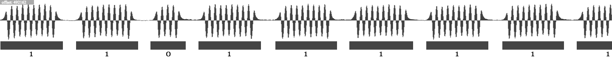
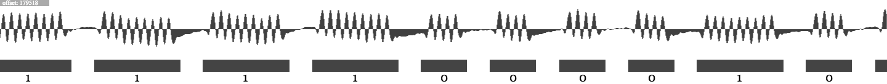
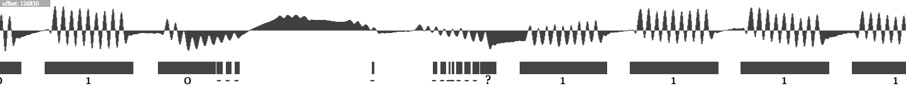

> Read wav files of old ZX81 tapes and save in .tzx format

## Usage
Make sure that [Node.js](https://nodejs.org/en/) is installed

Check out the project from github and open the project in a terminal; then type:

`npm install`

`npm start <path to wav file>`

This will load the wav file, scan for content, and open an editor window.

The top of the window visualizes the waveform and the frequency bursts extracted
from the waveform, along with the interpretation as either binary zero or binary
one. The editor allows you to edit data and correct any errors made
by the algorithm. The "save" button below the editor exports the data as a
valid .tzx file.

Although the algorithm does a fairly decent job, at least on our sample tape
images, you will want to do a manual sweep before saving. A good starting point is to go to the 
text edtor and search for '?' to find bursts that it had a hard time
categorizing.

The text format in the editor is documented [on a wiki page](https://github.com/mvindahl/zx81-dat-tape-reader/wiki/Editor-format).
The basics should be obvious from the initial contents of the editor. A useful thing to know is that
offset and length are optional; if omitted, the renderer will do its best to place the burst
correctly based upon the context.

The current version does not support load/save of the editor contents but
you can always copy/paste it to somewhere else.

## How does the algorithm work?
For the specification of the ZX81 tape format, please refer to [this nice writeup](http://problemkaputt.de/zxdocs.txt). Search the text for "
ZX80/ZX81 Cassette Signals".

The tool scans the waveform for bursts of 3.2Mhz activity. Then, based upon the lengths
of these, it does its best to determine if the format represents a zero or a one. 

It usually does a solid job for tapes of good quality:

.. also, works well for tapes where the signal has drifted and decayed:

.. but it does have its limits:

The latter case illustrates why you'd want to look through its results.

## Why was it created?
It all started at a local tech meetup.

A pal of mine, the much esteemed [@atjens](https://twitter.com/atjens) had brought a small bounty of
ZX81 tapes which he was scanning for a digital archeology project
that he was maintaining. The existing tools for extracting the content were from the 1990s and would rely
upon counting peaks. They had a tough time with some of the poorer tapes. As he lamented
about this, I said that it would probably not be too hard to do a 
frequency based algorithm which would work better.

So here we are, about one week later, created in small slots of spare time. It's not shiny but I believe that it's usable for its purpose.

## Why a text editor?
It was the cheapest way to implement a full editing experience. Also, I'd assume
that people who dabble with old ZX81 tapes won't mind it.

## Further reading
http://problemkaputt.de/zxdocs.txt
http://www.worldofspectrum.org/TZXformat.html
http://www.worldofspectrum.org/tapsamp.html
http://www.zx81stuff.org.uk/zx81/tapeutils/overview.html
