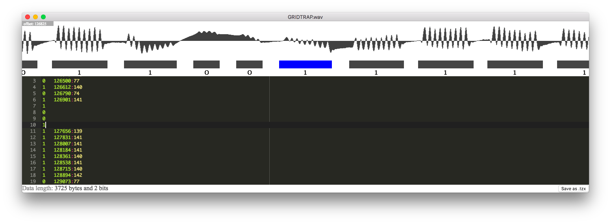

> Read wav files of old ZX81 and Lambda 8300 tapes and save in .tzx format

## Background

In the early days of home computers, [cassette tape](https://en.wikipedia.org/wiki/Compact_Cassette) was a popular means of data storage. Among others, the Sinclair [ZX81](https://en.wikipedia.org/wiki/ZX81) and the [Lambda 8300](https://en.wikipedia.org/wiki/Lambda_8300) were able to store programs on tape.

Some of these tapes still exist to this day, surfacing at flea markets and attics. Also, a very small community of [data archeologists](https://en.wikipedia.org/wiki/Data_archaeology) exists which try to salvage the contents. My mate, [@atjens](https://twitter.com/atjens), happens to be among those.

The individual bits of the program is encoded on the tape using [bursts of sine waves](http://www.worldofspectrum.org/tapsamp.html). Once the program has been successfully retrieved and stored in [tzx format](http://www.worldofspectrum.org/TZXformat.html), it can be run in an [emulator](http://www.zx81.nl/).

Decoding the contents of the tape represents a challenge, as the signal may have degraded over the decades. On the tape images used for testing, it was not uncommon for the signal to have diminished, been distorted, or almost to have been erased in places. The [existing software](http://www.zx81stuff.org.uk/zx81/tapeutils/overview.html) often used for converting from [.wav](https://en.wikipedia.org/wiki/WAV) to .tzx would have problems decoding these tapes as it detected amplitudes, not frequencies. A substantial manual preprocessing step was required to make it work for deteriorated tapes.

When I saw this at a local tech meetup, my immediate reaction was that this could be done better.

## Design Philosophy
- Detecting frequencies would work better than detecting amplitudes over some threshold since amplitudes would often vary across the tape.
- We cannot assume this to be fully automated in the general case. There will be a human validation step.
- This is made for a niche of a niche. Leverage existing libraries and components. Resist the urge to goldplate it. Keep it simple.

## Installation
Creating installer for various platforms would probably qualify as goldplating so you need to download the code from github yourself, either using git or as a zip file.

Also, you need to install [Node.js](https://nodejs.org/en/) if you haven't already.

Open the project in a terminal, then type:

`npm install`

This will fetch required dependencies.

## Usage
The basic workflow is as follows:
1. Digitize tape signal to .wav file
2. Open the wav file and let the tool analyze it for ones and zeroes
3. Review the analysis and edit if required
4. Output in .tzx format for the emulator
5. Run in emulator to verify

Only steps two through four will be in scope for this README.

### Open wav file in tool

In the terminal, type:

`npm start <path to wav file>`

This will load the wav file, scan for content, and open an editor window. Expect the analysis to take a few seconds.

### Review and edit analysis

Once the .wav file has been analyzed, an editor window is opened.

The top of the window visualizes the waveform from the .wav file. This is provided as a reference when reviewing.

Below the waveform, on the same axis, the detected frequency bursts are rendered. Also, an interpretation is rendered. Roughly speaking, any burst roughly matching the length of a zero or a one is interpreted as such. Any very short bursts are assumed to be noise and are marked as a dash, meaning "ignore this". All other bursts are maked as a question mark, meaning that they need to be manually reviewed.

The major part of the window is a text editor presenting the analysis in a textual form. This is the "source code" of the frequency bursts rendered above it, and editing the text will immediately rerender the visual representation. When placing the cursor on a line, the corresponding frequency burst will be rendered as blue.

The working assumption is that you will only need to edit small parts of the text. A useful way to find these parts is to use your standard text editor search shortcut and search for a question mark.

The text format in the editor is documented [on a wiki page](https://github.com/mvindahl/zx81-dat-tape-reader/wiki/Editor-format). Some usage examples will follow.

#### A fully readable tape
Sometimes the tape is nice and readable. In this example, seaching for '?' yields nothing, so we can go right ahead and save the .tzx file.

#### Broken bits
In this example, the signal was degraded for a short duration and the analysis interpreted it as noise.

From a quick visual inspection, it's clear that they should be maked as zeros. In the editor, remove the offending lines and insert two lines, each containing a zero digit. Verify that everything looks right in the visual representation.

One thing to note here is that while most lines in the text editor do encode an offset and a run length, these can be omitted, in which case they are inferred in the visual representation. This is very useful when fixing stuff.

#### Broken sequence
A similar example of tape degradation, this time making a number of bits almost unreadable.

Looking at the ripples, it's easy for a human to spot that the algorithm got the initial zero wrong and that the bit sequence should be 1-0-0-1.

There, fixed it in the editor. Again, the inferred offsets and run lengths turns out to be a useful feature.

### Saving to .tzx

In the lower right corner, there is a "save" which exports the data as a valid .tzx file. As one might expect, it will open a dialog for specifying where to save the output file.

## Further reading and previous art
- http://problemkaputt.de/zxdocs.txt
- http://www.worldofspectrum.org/TZXformat.html
- http://www.worldofspectrum.org/tapsamp.html
- http://www.zx81stuff.org.uk/zx81/tapeutils/overview.html
